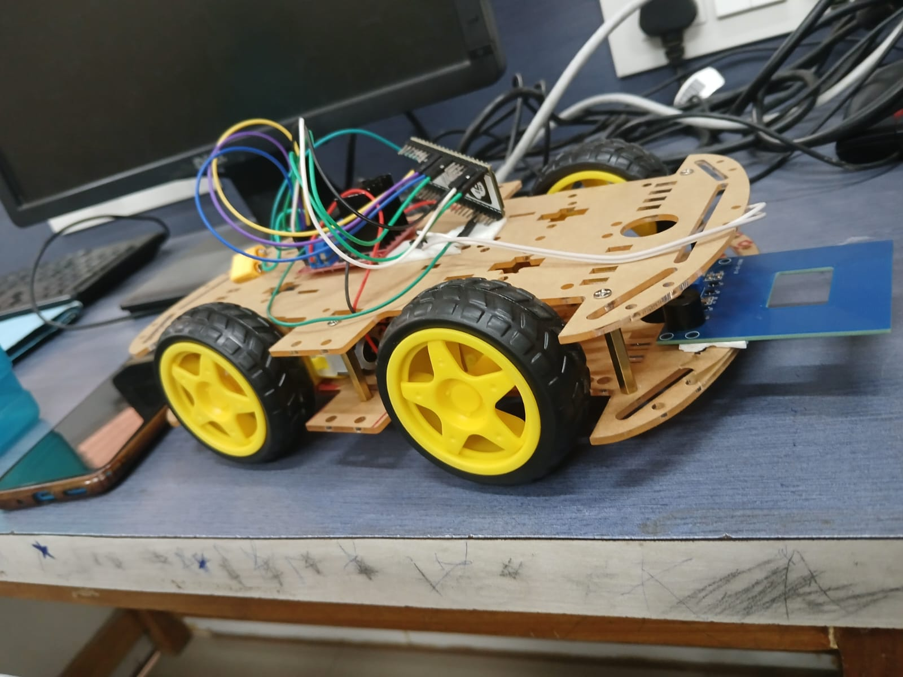

# PatrolCar Pro - ESP32 First-Year Project Stack

This workspace has been upgraded from a basic remote car demo to a full patrol robotics platform.



## What is new

- Modern ESP32 WebServer dashboard with live telemetry
- Patrol mode with obstacle-aware behavior
- API-based control endpoints for remote integration
- Dedicated Sensors folder with calibration and filtering assets
- Raspberry Pi bridge for MQTT monitoring and logging

## Workspace structure

```
Images/
	Remote_Car.jpeg
RemoteCar/
	RemoteCar.ino
Sensors/
	README.md
	calibration_profiles.json
	analysis/
		sensor_fusion.py
RaspberryPi/
	README.md
	requirements.txt
	patrol_bridge.py
	systemd/
		patrol-bridge.service
README.md
```

## ESP32 features in this version

- Soft AP mode network for direct control
- Browser dashboard at root endpoint
- HTTP API:
	- /api/drive?dir=forward|backward|left|right|stop
	- /api/speed?value=80..255
	- /api/patrol?enable=0|1
	- /api/headlight?enable=0|1
	- /api/status
- Telemetry fields:
	- motion
	- speed
	- distance_cm
	- battery_pct
	- rssi_dbm
	- patrol
	- headlights
	- uptime_s

## Hardware assumptions

- ESP32 dev board
- L298N motor driver
- DC gear motors (left and right)
- HC-SR04 ultrasonic sensor
- Battery voltage divider to ADC pin
- Optional headlight LED

## Build and run

1. Open [RemoteCar/RemoteCar.ino](RemoteCar/RemoteCar.ino) in Arduino IDE.
2. Select ESP32 board and serial port.
3. Install ESP32 board package and upload firmware.
4. Connect phone/laptop to Wi-Fi SSID PatrolCarLab.
5. Open browser to http://192.168.4.1.

## Raspberry Pi monitoring

1. Enter [RaspberryPi](RaspberryPi).
2. Install dependencies:

	 pip install -r requirements.txt

3. Start telemetry bridge:

	 python3 patrol_bridge.py --host 192.168.4.1 --mqtt-host localhost

4. Subscribe to MQTT topics for analytics and dashboards.

## Some Points Related to Projects

### First

- Manual web control
- Basic motor movement
- Single sensor readouts

- Telemetry APIs and filtered measurements
- Event logs and bridge process on Raspberry Pi
- Basic safety responses on obstacle detection

- Sensor fusion with IMU and encoder data
- Camera-assisted patrol decisions
- Mission planning and autonomous route graph
- Research-grade evaluation metrics in report

## Notes

- Tune pin mapping in [RemoteCar/RemoteCar.ino](RemoteCar/RemoteCar.ino) for your hardware.
- Calibrate battery and ultrasonic profiles in [Sensors/calibration_profiles.json](Sensors/calibration_profiles.json).
